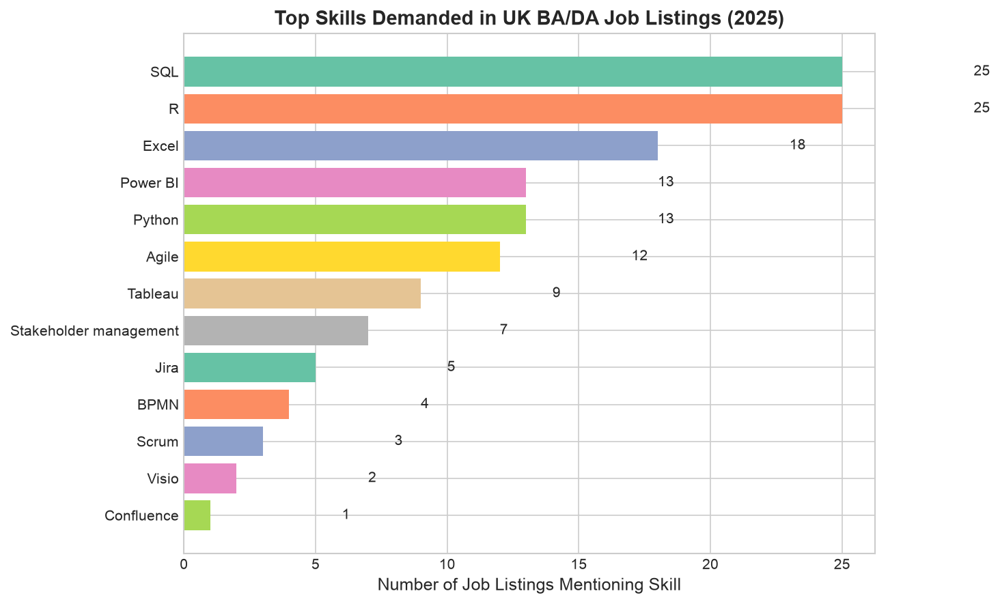

# UK Job Market Analysis: Business Analyst and Data Analyst Roles

**Tools:** Python (pandas, matplotlib, seaborn) · Plotly.js · GitHub Pages
**Data:** `sample_listings.csv`, a sample of **25 UK BA and DA job listings** posted 10 Jan to 4 Feb 2025. With 25 rows the findings are indicative only, not a statistically representative view of the UK market.
**Live dashboard:** [View the interactive dashboard](https://mayankjoshiii.github.io/uk-job-market-analysis/)



---

## Question

Which skills, salaries and work arrangements show up in UK Business Analyst and Data Analyst listings?

## Approach

| Step | What happens |
|------|-------------|
| 1. Data | 25 listings in a CSV (title, company, location, salary range, skills text, date) |
| 2. Cleaning | De-duplication, salary ranges parsed to a midpoint, locations mapped to regions, hybrid or remote read from the location text |
| 3. Skills | Keyword matching on word boundaries, so "R" only counts as the language and not every word with an r in it |
| 4. Visualisation | Notebook charts (`visualisations/`) and an interactive Plotly.js dashboard built from the same 25 listings |

## What the sample shows

- **Skills:** SQL appears in all 25 listings, Excel in 18, Power BI and Python in 13 each, Agile in 12 and Tableau in 9.
- **Salary:** the overall median salary midpoint is £49,000. London has 14 of the 25 listings, with a median midpoint of £52,000.
- **Work arrangement:** 9 listings mention hybrid and 1 remote. The other 15 don't say.
- **Roles:** 11 Business Analyst, 10 Data Analyst, 2 Senior BA, 2 Senior DA.

Run `python analyse_jobs.py` to reproduce these numbers.

## Repository structure

```
uk-job-market-analysis/
├── index.html            Interactive Plotly.js dashboard (GitHub Pages)
├── analyse_jobs.py       Cleaning, salary parsing, region and skill analysis
├── analysis.ipynb        Notebook version with charts and saved outputs
├── sample_listings.csv   The 25 listings
├── cleaned_listings.csv  Cleaned output from the notebook (for Tableau or similar)
├── visualisations/       Charts saved by the notebook
└── requirements.txt
```

## Run it

```bash
git clone https://github.com/mayankjoshiii/uk-job-market-analysis.git
cd uk-job-market-analysis
pip install -r requirements.txt
python analyse_jobs.py                  # analyse the bundled sample
python analyse_jobs.py my_listings.csv  # or your own CSV with the same columns
```

## Next step

The obvious extension is a larger dataset, for example pulling listings through the Reed jobseeker API, so the findings stop being anecdotal.

## Author

**Mayank Joshi**, Business and Data Analyst · MSc Business Analytics (Distinction), Swansea University
[LinkedIn](https://www.linkedin.com/in/mayank-joshi-analyst/) · [GitHub](https://github.com/mayankjoshiii)
